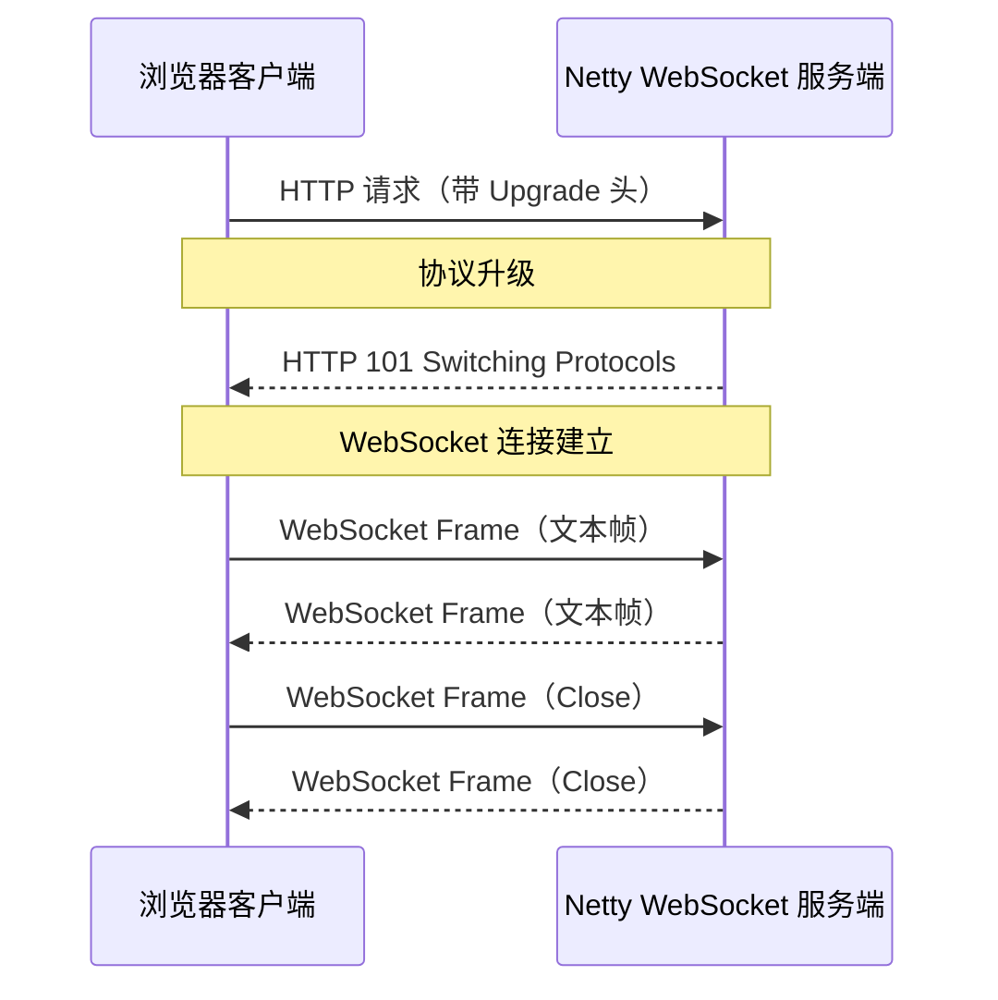

# WebSocket 聊天

WebSocket 是 HTML5 的全双工通信协议，适合实时应用。本章构建一个带 Web 界面的聊天室。

## WebSocket 协议简介



## 服务端实现

### WebSocketServer.java

```java
public class WebSocketServer {
    private final int port;

    public WebSocketServer(int port) {
        this.port = port;
    }

    public void start() throws Exception {
        EventLoopGroup bossGroup = new NioEventLoopGroup(1);
        EventLoopGroup workerGroup = new NioEventLoopGroup();

        try {
            ServerBootstrap bootstrap = new ServerBootstrap();
            bootstrap.group(bossGroup, workerGroup)
                     .channel(NioServerSocketChannel.class)
                     .childHandler(new ChannelInitializer<SocketChannel>() {
                         @Override
                         protected void initChannel(SocketChannel ch) {
                             ch.pipeline()
                                 // HTTP 协议支持
                                 .addLast(new HttpServerCodec())
                                 .addLast(new ChunkedWriteHandler())
                                 .addLast(new HttpObjectAggregator(8192))

                                 // WebSocket 协议处理
                                 .addLast(new WebSocketServerProtocolHandler("/ws"))

                                 // 业务处理
                                 .addLast(new TextWebSocketFrameHandler());
                         }
                     });

            ChannelFuture future = bootstrap.bind(port).sync();
            System.out.println("WebSocket 聊天室启动: http://localhost:" + port);
            future.channel().closeFuture().sync();
        } finally {
            bossGroup.shutdownGracefully();
            workerGroup.shutdownGracefully();
        }
    }

    public static void main(String[] args) throws Exception {
        new WebSocketServer(8080).start();
    }
}
```

### TextWebSocketFrameHandler.java

```java
public class TextWebSocketFrameHandler
        extends SimpleChannelInboundHandler<TextWebSocketFrame> {

    // 管理所有 WebSocket 连接
    private static final ChannelGroup channels = new DefaultChannelGroup(
        GlobalEventExecutor.INSTANCE);

    @Override
    public void handlerAdded(ChannelHandlerContext ctx) {
        Channel incoming = ctx.channel();
        channels.writeAndFlush(
            new TextWebSocketFrame("[系统] " + incoming.remoteAddress() + " 加入"));
        channels.add(incoming);
        System.out.println("客户端连接: " + incoming.remoteAddress() + " (在线: "
                           + channels.size() + ")");
    }

    @Override
    public void handlerRemoved(ChannelHandlerContext ctx) {
        Channel outgoing = ctx.channel();
        channels.writeAndFlush(
            new TextWebSocketFrame("[系统] " + outgoing.remoteAddress() + " 离开"));
        System.out.println("客户端断开: " + outgoing.remoteAddress() + " (在线: "
                           + channels.size() + ")");
    }

    @Override
    protected void channelRead0(ChannelHandlerContext ctx,
                                 TextWebSocketFrame frame) {
        String text = frame.text();
        System.out.println("收到消息: " + text);

        // 广播消息
        Channel sender = ctx.channel();
        for (Channel channel : channels) {
            if (channel != sender) {
                channel.writeAndFlush(
                    new TextWebSocketFrame(
                        "[" + sender.remoteAddress() + "]: " + text));
            } else {
                channel.writeAndFlush(
                    new TextWebSocketFrame("[我]: " + text));
            }
        }
    }

    @Override
    public void exceptionCaught(ChannelHandlerContext ctx, Throwable cause) {
        cause.printStackTrace();
        ctx.close();
    }
}
```

## 前端页面（嵌入服务端）

```java
public class WebIndexHandler extends SimpleChannelInboundHandler<FullHttpRequest> {

    @Override
    protected void channelRead0(ChannelHandlerContext ctx, FullHttpRequest request) {
        if ("/ws".equals(request.uri())) {
            ctx.fireChannelRead(request.retain());  // 交给 WebSocket 处理
            return;
        }

        // 返回聊天页面
        String html = getChatPageHTML();
        FullHttpResponse response = new DefaultFullHttpResponse(
            HttpVersion.HTTP_1_1,
            HttpResponseStatus.OK,
            Unpooled.copiedBuffer(html, StandardCharsets.UTF_8)
        );
        response.headers()
            .set(HttpHeaderNames.CONTENT_TYPE, "text/html; charset=UTF-8")
            .set(HttpHeaderNames.CONTENT_LENGTH, html.getBytes().length);

        HttpUtil.setKeepAlive(response, true);
        ctx.writeAndFlush(response).addListener(ChannelFutureListener.CLOSE);
    }

    private String getChatPageHTML() {
        return """
<!DOCTYPE html>
<html>
<head>
    <meta charset="UTF-8">
    <title>WebSocket 聊天室</title>
    <style>
        * { margin: 0; padding: 0; box-sizing: border-box; }
        body { font-family: sans-serif; background: #0d1117; color: #e6edf3; }
        .container { max-width: 800px; margin: 50px auto; }
        h1 { text-align: center; color: #58a6ff; margin-bottom: 20px; }
        #messages { height: 400px; overflow-y: auto; background: #161b22;
                    border: 1px solid #30363d; border-radius: 8px;
                    padding: 16px; margin-bottom: 16px; white-space: pre-wrap; }
        #input-area { display: flex; gap: 8px; }
        #message { flex: 1; padding: 10px; background: #0d1117;
                   border: 1px solid #30363d; border-radius: 8px;
                   color: #e6edf3; font-size: 14px; }
        button { padding: 10px 24px; background: #1f6feb; color: white;
                 border: none; border-radius: 8px; cursor: pointer; }
        button:hover { background: #388bfd; }
        .system { color: #8b949e; }
        .my { color: #58a6ff; }
        .other { color: #e6edf3; }
    </style>
</head>
<body>
    <div class="container">
        <h1>WebSocket 聊天室</h1>
        <div id="messages"></div>
        <div id="input-area">
            <input type="text" id="message" placeholder="输入消息..." />
            <button onclick="send()">发送</button>
        </div>
    </div>

    <script>
        var ws = new WebSocket("ws://" + location.host + "/ws");

        ws.onopen = function() {
            addMessage("已连接到聊天室", "system");
        };

        ws.onmessage = function(evt) {
            addMessage(evt.data, "other");
        };

        ws.onclose = function() {
            addMessage("连接断开", "system");
        };

        function send() {
            var input = document.getElementById("message");
            if (input.value.trim()) {
                ws.send(input.value);
                addMessage("[我]: " + input.value, "my");
                input.value = "";
            }
        }

        document.getElementById("message").addEventListener("keypress", function(e) {
            if (e.key === "Enter") send();
        });

        function addMessage(msg, type) {
            var div = document.createElement("div");
            div.className = type;
            div.textContent = msg;
            var box = document.getElementById("messages");
            box.appendChild(div);
            box.scrollTop = box.scrollHeight;
        }
    </script>
</body>
</html>""";
    }
}
```

## 完整 Pipeline

```java
ch.pipeline()
    .addLast(new HttpServerCodec())                          // HTTP 编解码
    .addLast(new ChunkedWriteHandler())                      // 大块写入
    .addLast(new HttpObjectAggregator(8192))                 // 聚合
    .addLast(new WebIndexHandler())                          // 返回 HTML 页面
    .addLast(new WebSocketServerProtocolHandler("/ws"))      // WebSocket 升级
    .addLast(new TextWebSocketFrameHandler());               // 聊天业务
```

## 测试

```bash
# 启动后浏览器访问
http://localhost:8080/

# 多个浏览器窗口同时打开，即可聊天
```

::: tip Pipeline 顺序说明
1. HTTP 相关的 Handler 在前，WebSocket 相关在后
2. `WebSocketServerProtocolHandler` 自动处理 HTTP 升级为 WebSocket
3. `/ws` 路径用于 WebSocket，其他路径返回 HTTP 响应
:::
