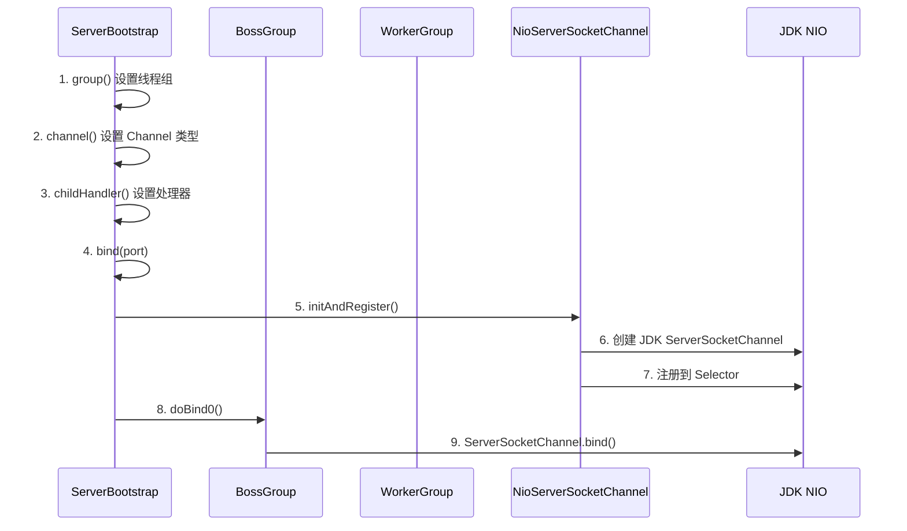
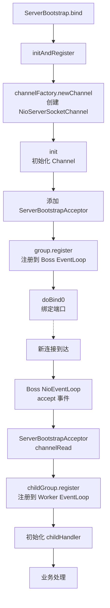

# Bootstrap 启动流程源码分析

Bootstrap 是 Netty 的入口，掌握启动流程是理解 Netty 源码的第一步。

## 启动流程概览



## 核心源码分析

### 1. ServerBootstrap 配置链

```java
// ServerBootstrap.java
ServerBootstrap bootstrap = new ServerBootstrap();
bootstrap.group(bossGroup, workerGroup)
         .channel(NioServerSocketChannel.class)
         .childHandler(new ChannelInitializer<SocketChannel>() { ... });
```

源码中的关键属性：

```java
public class ServerBootstrap extends AbstractBootstrap<ServerBootstrap, ServerChannel> {
    // 子 Channel 的配置
    private final Map<ChannelOption<?>, Object> childOptions = new LinkedHashMap<>();
    private final Map<AttributeKey<?>, Object> childAttrs = new HashMap<>();
    // Worker Group
    private volatile EventLoopGroup childGroup;
    // 子 Channel 的 Handler
    private volatile ChannelHandler childHandler;
}
```

### 2. bind() 入口

```java
// AbstractBootstrap.java
public ChannelFuture bind(int inetPort) {
    return bind(new InetSocketAddress(inetPort));
}

public ChannelFuture bind(SocketAddress localAddress) {
    validate();  // 校验 group 和 channelFactory
    return doBind(localAddress);
}

private ChannelFuture doBind(final SocketAddress localAddress) {
    // 核心三步：
    final ChannelFuture regFuture = initAndRegister();  // 初始化 + 注册
    final Channel channel = regFuture.channel();
    
    if (regFuture.isDone()) {
        doBind0(regFuture, channel, localAddress, promise);  // 绑定端口
    } else {
        regFuture.addListener(f -> doBind0(...));  // 注册完成后再绑定
    }
    return promise;
}
```

### 3. initAndRegister() — 创建 Netty Channel

```java
// AbstractBootstrap.java
final ChannelFuture initAndRegister() {
    Channel channel = null;
    // 1. 通过 ChannelFactory 创建 Channel 实例
    channel = channelFactory.newChannel();  // 反射创建 NioServerSocketChannel
    
    // 2. 初始化 Channel（模板方法，子类实现）
    init(channel);  // ServerBootstrap.init()
    
    // 3. 注册到 EventLoopGroup 的 Selector
    ChannelFuture regFuture = config().group().register(channel);
    
    return regFuture;
}
```

### 4. ServerBootstrap.init() — 服务端特有初始化

```java
// ServerBootstrap.java
@Override
void init(Channel channel) {
    // 1. 设置 ChannelOption 和 ChannelAttr
    setChannelOptions(channel, options, logger);
    setAttributes(channel, attrs);
    
    ChannelPipeline p = channel.pipeline();
    
    // 2. 添加一个 ChannelInitializer（在注册时执行）
    p.addLast(new ChannelInitializer<Channel>() {
        @Override
        public void initChannel(final Channel ch) {
            final ChannelPipeline pipeline = ch.pipeline();
            ChannelHandler handler = config.handler();  // 用户设置的 handler()
            if (handler != null) {
                pipeline.addLast(handler);
            }
            
            // 3. 关键！添加 ServerBootstrapAcceptor
            ch.eventLoop().execute(() -> {
                pipeline.addLast(new ServerBootstrapAcceptor(
                    ch, currentChildGroup, currentChildHandler,
                    currentChildOptions, currentChildAttrs));
            });
        }
    });
}
```

### 5. ServerBootstrapAcceptor — 新连接的接收器

当有新客户端连接时，Acceptor 负责为子 Channel 配置 Pipeline：

```java
// ServerBootstrapAcceptor.java
public void channelRead(ChannelHandlerContext ctx, Object msg) {
    final Channel child = (Channel) msg;  // 新连接的 SocketChannel
    
    // 设置 childHandler（用户传入的业务 Handler）
    child.pipeline().addLast(childHandler);
    
    // 设置 childOptions
    setChannelOptions(child, childOptions, logger);
    setAttributes(child, childAttrs);
    
    // 将子 Channel 注册到 WorkerGroup 的 EventLoop
    childGroup.register(child).addListener(future -> {
        if (!future.isSuccess()) {
            forceClose(child, future.cause());
        }
    });
}
```

## 完整启动流程图



::: tip 总结
1. ServerBootstrap 和 Bootstrap 的最主要区别在于 **childHandler** 和 **ServerBootstrapAcceptor**
2. BossGroup 处理 accept 事件，WorkerGroup 处理读写事件
3. 每个新连接都会通过 ServerBootstrapAcceptor 注册到 Worker EventLoop
:::
