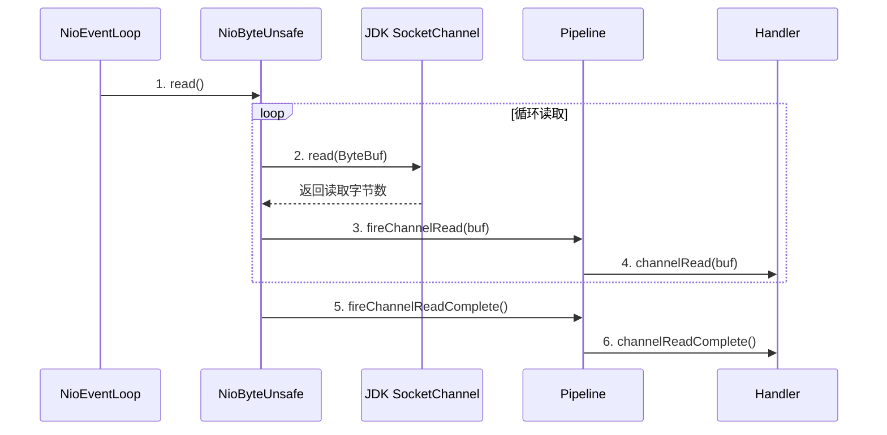
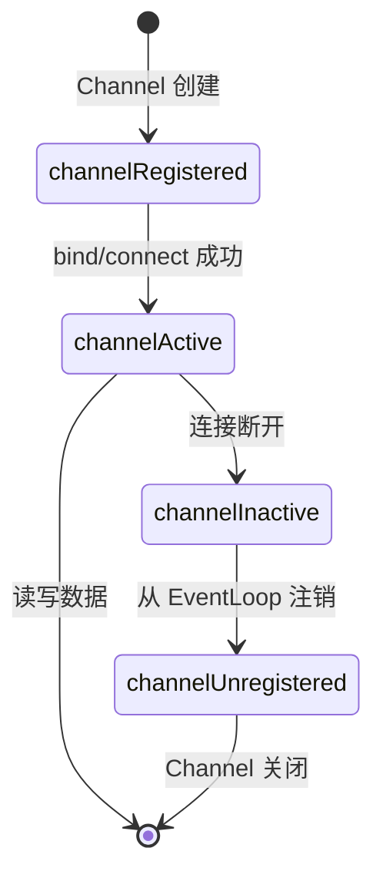

# Channel 实现原理源码分析

Channel 是 Netty 对 JDK Channel 的高级封装。本章分析 Channel 的创建过程、生命周期和底层 IO 操作。

## Channel 类层次结构

```
Channel (接口)
  └── ServerChannel (接口)
  └── SocketChannel (接口)
        └── AbstractChannel (抽象类)
              └── AbstractNioChannel
                    ├── AbstractNioMessageChannel
                    │     └── NioServerSocketChannel
                    └── AbstractNioByteChannel
                          └── NioSocketChannel
```

## Channel 的创建过程

### NioServerSocketChannel 构造

```java
// NioServerSocketChannel.java
public NioServerSocketChannel() {
    // 1. 通过 JDK 的 SelectorProvider 创建 ServerSocketChannel
    this(newSocket(DEFAULT_SELECTOR_PROVIDER));
}

private static ServerSocketChannel newSocket(SelectorProvider provider) {
    return provider.openServerSocketChannel();  // JDK NIO API
}

public NioServerSocketChannel(ServerSocketChannel channel) {
    super(null, channel, SelectionKey.OP_ACCEPT);  // 关注 ACCEPT 事件
    config = new NioServerSocketChannelConfig(this, javaChannel().socket());
}

// AbstractNioChannel.java
protected AbstractNioChannel(Channel parent, SelectableChannel ch, int readInterestOp) {
    super(parent);
    this.ch = ch;
    this.readInterestOp = readInterestOp;
    // 设置非阻塞模式（关键！）
    ch.configureBlocking(false);  // JDK Channel 必须为非阻塞
}
```

### NioSocketChannel 构造

```java
// NioSocketChannel.java
public NioSocketChannel() {
    this(DEFAULT_SELECTOR_PROVIDER);
}

public NioSocketChannel(SelectorProvider provider) {
    // 1. 创建 JDK SocketChannel
    this(newSocket(provider));
}

public NioSocketChannel(SocketChannel socket) {
    this(null, socket);  // parent = null（客户端 Channel 没有父 Channel）
}

protected AbstractNioByteChannel(Channel parent, SelectableChannel ch) {
    super(parent, ch, SelectionKey.OP_READ);  // 关注 READ 事件
}
```

## 事件注册 — register()

```java
// AbstractChannel.java
public final void register(EventLoop eventLoop, final ChannelPromise promise) {
    // 1. 绑定 EventLoop
    AbstractChannel.this.eventLoop = eventLoop;
    
    // 2. 确保在 EventLoop 的线程中执行注册
    if (eventLoop.inEventLoop()) {
        register0(promise);
    } else {
        eventLoop.execute(() -> register0(promise));
    }
}

// AbstractNioChannel.java
private void register0(ChannelPromise promise) {
    // 1. JDK 层面的注册
    selectionKey = javaChannel().register(
        eventLoop().unwrappedSelector(),  // Netty 的 Selector
        0,                                 // 初始不关注任何事件
        this                               // attachment 设为 Netty Channel
    );
    
    // 2. 触发 Handler 事件
    pipeline.fireChannelRegistered();   // → 触发 channelRegistered
    pipeline.fireChannelActive();       // → 触发 channelActive
}
```

## Unsafe — 底层 IO 操作

Channel 的底层 IO 操作委托给内部的 `Unsafe` 对象执行：

```java
// AbstractNioByteChannel.NioByteUnsafe.java
private final class NioByteUnsafe extends AbstractNioUnsafe {
    
    @Override
    public final void read() {
        final ChannelConfig config = config();
        final ChannelPipeline pipeline = pipeline();
        final ByteBufAllocator allocator = config.getAllocator();
        final int maxMessagesPerRead = config.getMaxMessagesPerRead();
        
        for (;;) {
            // 1. 分配 ByteBuf
            ByteBuf byteBuf = allocHandle.allocate(allocator);
            
            // 2. 从 JDK Channel 读取数据到 ByteBuf
            int localReadAmount = doReadBytes(byteBuf);
            
            if (localReadAmount <= 0) {
                byteBuf.release();
                break;  // 没有数据了
            }
            
            // 3. 触发 ChannelPipeline 的 channelRead
            pipeline.fireChannelRead(byteBuf);
            
            if (totalReadAmount >= maxMessagesPerRead) {
                break;  // 单次读取过多，防止饥饿
            }
        }
        
        // 4. 触发 channelReadComplete
        pipeline.fireChannelReadComplete();
    }
}
```

### 数据读取流程



## Socket 参数配置 — ChannelConfig

```java
// NioSocketChannelConfig 关联 JDK Socket 参数
NioSocketChannelConfig config = (NioSocketChannelConfig) channel.config();

// 可配置的参数：
config.setTcpNoDelay(true);            // 禁用 Nagle 算法
config.setSoLinger(0);                 // 关闭时立即断开
config.setKeepAlive(true);             // TCP 保活
config.setSoRcvBuf(1024 * 64);        // 接收缓冲区 64KB
config.setSoSndBuf(1024 * 64);        // 发送缓冲区 64KB
config.setAllocator(...);               // ByteBuf 分配器
config.setRecvByteBufAllocator(...);    // 接收缓冲区分配器
```

## Channel 生命周期



对应的 Handler 事件方法：

| 生命周期事件 | Handler 回调 | 说明 |
|-------------|-------------|------|
| 创建 | — | `new NioSocketChannel()` |
| 注册 | `handlerAdded` → `channelRegistered` | 注册到 EventLoop |
| 激活 | `channelActive` | 连接建立或端口绑定 |
| 就绪 | `channelRead` / `channelReadComplete` | 可读写数据 |
| 失活 | `channelInactive` | 连接断开 |
| 注销 | `channelUnregistered` | 从 EventLoop 移除 |
| 移除 | `handlerRemoved` | Handler 被移除 |

::: tip 总结
Netty Channel 是对 JDK Channel 的封装，核心增强包括：
1. 统一的非阻塞 API，自动设置 `configureBlocking(false)`
2. Unsafe 接口负责底层 IO，分离了网络细节
3. 与 Pipeline 紧密集成，IO 事件通过 Pipeline 传播
4. 丰富的 ChannelConfig 配置能力
:::
