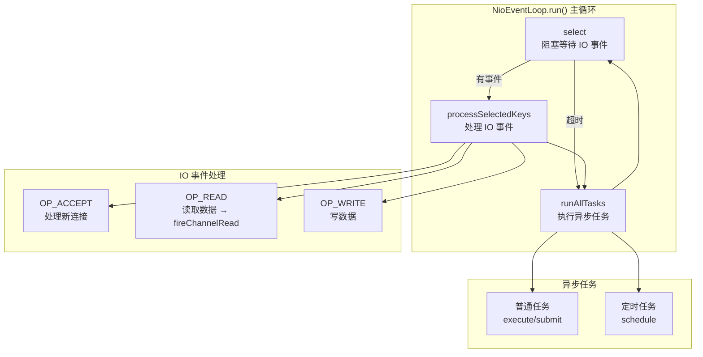

# EventLoop 线程模型源码分析

EventLoop 是 Netty 的核心引擎，理解 EventLoop 就是理解 Netty 如何实现高性能的事件循环。

## 类层次结构

```
EventExecutorGroup
  └── EventLoopGroup
        └── MultithreadEventLoopGroup
              └── NioEventLoopGroup
                    
EventExecutor
  └── EventLoop
        └── SingleThreadEventLoop
              └── NioEventLoop
```

## NioEventLoopGroup 源码

### 构造过程

```java
// NioEventLoopGroup.java
public NioEventLoopGroup() {
    this(0);  // 默认 nThreads = 0
}

public NioEventLoopGroup(int nThreads) {
    this(nThreads, (Executor) null);
}

// 最终调到这里
protected MultithreadEventLoopGroup(int nThreads, Executor executor, Object... args) {
    super(nThreads == 0 
        ? DEFAULT_EVENT_LOOP_THREADS  // 默认：CPU核数 * 2
        : nThreads, 
        executor, args);
}
```

### 初始化 NioEventLoop 数组

```java
// MultithreadEventExecutorGroup.java
protected MultithreadEventExecutorGroup(int nThreads, Executor executor, ...) {
    // 1. 创建 NioEventLoop 数组
    children = new EventExecutor[nThreads];
    for (int i = 0; i < nThreads; i++) {
        children[i] = newChild(executor, args);  // 创建 NioEventLoop
    }
    
    // 2. 创建选择器
    chooser = chooserFactory.newChooser(children);  // 轮询选择 EventLoop
    
    // 3. 启动所有 EventLoop 线程
    for (EventExecutor e : children) {
        e.submit(() -> { /* 触发线程启动 */ });
    }
}
```

### 选择器轮询

```java
// 轮询策略：使用 & 位运算替代 %，效率更高
// 当 children.length 是 2 的幂时：
public EventExecutor next() {
    return executors[idx.getAndIncrement() & executors.length - 1];
}
```

## NioEventLoop 源码

### run() — 事件循环主方法

```java
// NioEventLoop.java
@Override
protected void run() {
    for (;;) {  // 死循环，持续处理事件
        try {
            switch (selectStrategy.calculateStrategy(selectNowSupplier, hasTasks())) {
                case SelectStrategy.CONTINUE:
                    continue;
                case SelectStrategy.SELECT:
                    select(wakenUp.getAndSet(false));  // 阻塞等待 IO 事件
                    if (wakenUp.get()) {
                        selector.wakeup();  // 被唤醒
                    }
                    // fall through
                default:
            }
        } catch (IOException e) {
            rebuildSelector0();  // epoll bug 兜底：重建 Selector
            continue;
        }
        
        // 处理就绪的 IO 事件
        processSelectedKeys();
        
        // 运行所有异步任务
        runAllTasks();
    }
}
```

### select() — IO 事件轮询

```java
private void select(boolean oldWakenUp) throws IOException {
    Selector selector = this.selector;
    
    int selectedKeys = selector.select(timeoutMillis);  // JDK Selector.select()
    
    if (selectedKeys != 0 || oldWakenUp || hasTasks() || hasScheduledTasks()) {
        return;  // 有就绪事件
    }
    
    // ... 处理 epoll 空轮询 bug
    long time = System.nanoTime();
    if (time - TimeUnit.MILLISECONDS.toNanos(timeoutMillis) 
        >= currentTimeNanos) {
        selectCnt = 1;  // 正常情况
    } else if (SELECTOR_AUTO_REBUILD_THRESHOLD > 0 &&
               selectCnt >= SELECTOR_AUTO_REBUILD_THRESHOLD) {
        // epoll bug！空轮询次数达到阈值 (512) → 重建 Selector
        rebuildSelector();
        selectCnt = 1;
    }
}
```

### processSelectedKeys() — 处理 IO 事件

```java
private void processSelectedKeys() {
    // 1. 获取就绪的 SelectionKey 集合
    SelectedSelectionKeySet selectedKeys = selector.selectedKeys();
    
    // 2. 遍历处理每个就绪事件
    for (SelectionKey k : selectedKeys) {
        AbstractNioChannel ch = (AbstractNioChannel) k.attachment();
        
        // 3. 调用 Channel 的 Unsafe 处理事件
        processSelectedKey(k, ch);
    }
}
```

### 性能优化 — SelectedSelectionKeySet

Netty 对 JDK SelectionKey 的 Set 做了优化（通过反射替换 HashSet 为数组）：

```java
// 自定义的 SelectedSelectionKeySet，基于数组，比 HashSet 更快
final class SelectedSelectionKeySet extends AbstractSet<SelectionKey> {
    SelectionKey[] keys;     // 数组存储
    int size;
    
    @Override
    public boolean add(SelectionKey key) {
        keys[size++] = key;  // O(1) 直接追加，比 HashSet.add() 快
        return true;
    }
}
```

## runAllTasks — 任务处理

```java
protected boolean runAllTasks(long timeoutNanos) {
    // 1. 将定时任务转移到普通任务队列
    fetchFromScheduledTaskQueue();
    
    // 2. 执行所有任务
    Runnable task = pollTask();
    if (task == null) return false;
    
    for (;;) {
        // 执行任务
        safeExecute(task);
        task = pollTask();
        
        // 超时检查（防止任务执行太久，影响 IO 处理）
        if (timeoutNanos <= 0 || task == null) {
            break;
        }
    }
    return true;
}
```

## 线程模型总结



::: tip 关键结论
1. EventLoop 是**单线程**驱动多个 Channel 的 IO 事件和任务
2. IO 事件和异步任务是**相同的线程**执行的，保证线程安全
3. Netty 通过反射替换 `SelectedSelectionKeySet` 来优化性能
4. 检测到 epoll 空轮询（512 次）时自动重建 Selector
:::
