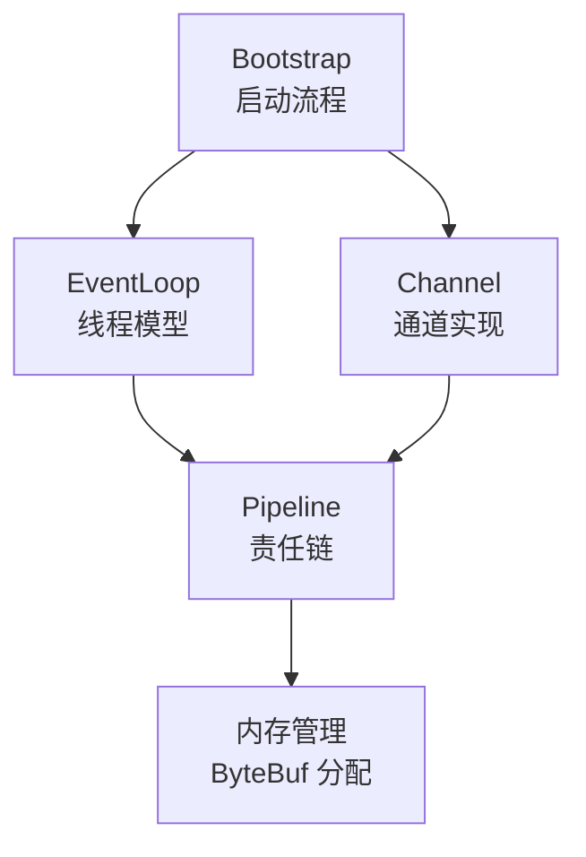

# 源码分析概述

本章节深入 Netty 4.x 源码，剖析核心模块的实现原理。

::: info 阅读前提
建议先完成**基础知识**章节的学习，对 Netty 核心组件有基本了解后再阅读本章节。
:::

## 源码分析路线



## 核心类关系图

```
NioEventLoopGroup (线程池)
  └── NioEventLoop (单线程)
        ├── Selector (多路复用器)
        ├── TaskQueue (任务队列)
        └── 管理多个 Channel
              └── Channel
                    ├── Unsafe (底层 IO 操作)
                    └── Pipeline
                          ├── Head (链表头)
                          ├── Handler-1
                          ├── Handler-2
                          └── Tail (链表尾)
```

## 各模块要点

| 模块 | 核心问题 | 学完你将理解 |
|------|----------|-------------|
| Bootstrap | 启动流程是怎样的？ | Netty 的初始化过程和配置加载 |
| EventLoop | 为什么能一个线程处理多个连接？ | NIO 多路复用的内部实现 |
| Channel | Channel 是如何创建的？ | JDK NIO Channel 到 Netty Channel 的包装过程 |
| Pipeline | 事件如何在 Handler 间传播？ | 责任链模式的实现细节 |
| 内存管理 | 如何实现高性能内存分配？ | 池化分配、对象复用技术 |
