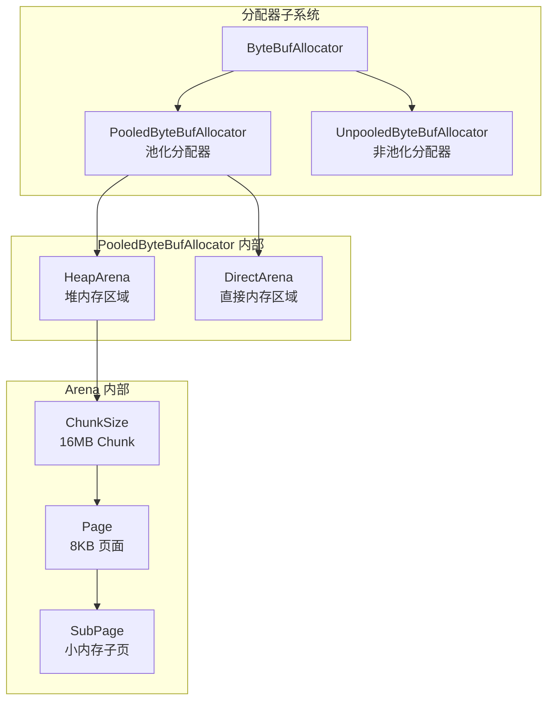
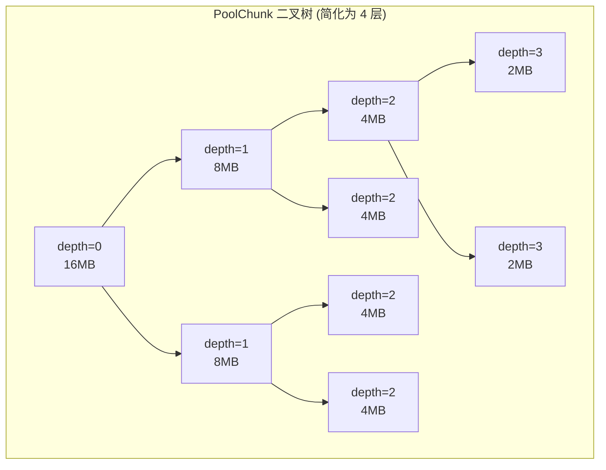

# 内存管理机制源码分析

Netty 的内存管理是高性能的关键。本章深入 PooledByteBufAllocator 和对象复用技术。

## 内存管理全景



## 为什么需要池化

| 对比 | 非池化 | 池化 |
|------|--------|------|
| 分配速度 | 每次都系统调用 | 从池中取，快 10-100 倍 |
| GC 压力 | 大量 ByteBuf 对象被 GC | 复用对象，几乎无 GC |
| 内存碎片 | 频繁分配/释放导致 | 固定大小分块，无碎片 |
| 推荐场景 | 开发测试 | **生产环境** |

## 核心概念

### 1. Arena — 内存分配区域

```java
abstract class PoolArena<T> {
    // 管理的内存类型：byte[] (Heap) 或 ByteBuffer (Direct)
    
    // 内存规格
    static final int numTinySubpagePools = 512 >>> 4;  // 微小内存 (0~496B)
    
    // 各种规格的内存管理
    private final PoolSubpage<T>[] tinySubpagePools;   // Tiny
    private final PoolSubpage<T>[] smallSubpagePools;   // Small
    private final PoolChunkList<T> q050;                 // 使用率 50-100%
    private final PoolChunkList<T> q025;                 // 使用率 25-75%
    private final PoolChunkList<T> q000;                 // 使用率 0-50%
    private final PoolChunkList<T> qInit;                // 初始
    private final PoolChunkList<T> q075;                 // 使用率 75-100%
    private final PoolChunkList<T> q100;                 // 使用率 100%
}
```

### 2. 内存规格分类

```
申请大小 → 对号入座

+-------------------+----------------+----------------+------------------+
|    Tiny           |    Small       |    Normal      |     Huge         |
|    n * 16B        |    8KB 的倍率   |    8KB~16MB    |     > 16MB       |
+-------------------+----------------+----------------+------------------+

Tiny: 申请 16B → 规格化为 16B
      申请 32B → 规格化为 32B
      申请 48B → 规格化为 48B  (都标准化为 16 的倍数)

Small: 申请 512B  → 规格化为 512B
       申请 1024B → 规格化为 1024B

Normal: 使用 PoolChunk 存储（8KB Page 的倍数）

Huge: 不走池化，直接分配并释放
```

### 3. PoolChunk — 大块内存

```java
// PoolChunk 是一次性向操作系统申请的 16MB 大块内存
final class PoolChunk<T> implements PoolChunkMetric {
    final PoolArena<T> arena;
    final T memory;  // 底层内存：byte[] (Heap) 或 ByteBuffer (Direct)
    
    // 完全二叉树，每个节点记录一个 Page 的使用状态
    private final byte[] memoryMap;  // 节点 → Page 映射
    private final byte[] depthMap;   // 节点 → 深度
    
    // 默认 16MB，按 8KB Page 划分
    static final int MAX_DEPTH = 11;
    static final int MAX_PAGE_SHIFT = 1 << MAX_DEPTH;  // 2048 个 Page
}
```

内存管理使用**平衡二叉树**（类似 jemalloc）：



## 分配流程

```java
// PooledByteBufAllocator.java
@Override
protected ByteBuf newDirectBuffer(int initialCapacity, int maxCapacity) {
    // 1. 获取线程绑定的 PoolThreadCache
    PoolThreadCache cache = threadCache.get();
    PoolArena<ByteBuffer> directArena = cache.directArena;
    
    // 2. 从 Arena 分配
    ByteBuf buf = directArena.allocate(cache, initialCapacity, maxCapacity);
    
    return toLeakAwareBuffer(buf);  // 包装泄漏检测
}
```

### PoolThreadCache — 线程本地缓存

```java
final class PoolThreadCache {
    // 每个线程有自己的内存缓存，减少锁竞争
    final PoolArena<byte[]> heapArena;
    final PoolArena<ByteBuffer> directArena;
    
    // 缓存已释放的小内存块，快速复用
    private final MemoryRegionCache<byte[]>[] tinySubPageHeapCaches;
    private final MemoryRegionCache<byte[]>[] smallSubPageHeapCaches;
    private final MemoryRegionCache<ByteBuffer>[] tinySubPageDirectCaches;
    private final MemoryRegionCache<ByteBuffer>[] smallSubPageDirectCaches;
    // ...
}
```

## 对象复用 — Recycler

Netty 不仅池化内存，还池化对象：

```java
// Recycler.java — 轻量级对象池
public abstract class Recycler<T> {
    
    // 每个线程有自己的 Stack，无锁获取
    private final FastThreadLocal<Stack<T>> threadLocal = new FastThreadLocal<>() {
        @Override
        protected Stack<T> initialValue() {
            return new Stack<>(Recycler.this, Thread.currentThread(), ...);
        }
    };
    
    // 获取对象
    public final T get() {
        Stack<T> stack = threadLocal.get();
        DefaultHandle<T> handle = stack.pop();  // 从栈顶取
        if (handle != null) {
            return handle.value;
        }
        // 栈为空，创建新对象
        handle = newHandle();
        handle.value = newObject(handle);
        return handle.value;
    }
    
    // 回收对象
    public final boolean recycle(T obj, Handle<T> handle) {
        Stack<T> stack = threadLocal.get();
        stack.push(handle);  // 压回栈中复用
        return true;
    }
}
```

使用示例：

```java
// 定义一个可回收的对象
static final class MyObject {
    private static final Recycler<MyObject> RECYCLER = new Recycler<MyObject>() {
        @Override
        protected MyObject newObject(Handle<MyObject> handle) {
            return new MyObject(handle);
        }
    };
    
    private final Recycler.Handle<MyObject> handle;
    
    MyObject(Recycler.Handle<MyObject> handle) {
        this.handle = handle;
    }
    
    void recycle() {
        handle.recycle(this);  // 回收复用
    }
    
    // 使用方式
    static MyObject newInstance() {
        return RECYCLER.get();
    }
}
```

## 内存泄漏检测

Netty 提供了多级泄漏检测：

```java
// 启动参数设置：-Dio.netty.leakDetectionLevel=PARANOID
public enum Level {
    DISABLED,   // 关闭检测
    SIMPLE,     // 简单检测，约 1% 的 ByteBuf 被采样
    ADVANCED,   // 高级检测，记录访问位置
    PARANOID,   // 100% 检测所有 ByteBuf（开发环境推荐）
}
```

泄漏检测报告示例：

```
LEAK: ByteBuf.release() was not called before it's garbage-collected.
Recent access records:
#1: Created at:
    io.netty.buffer.PooledByteBufAllocator.newDirectBuffer(...)
#2: Accessed at:
    com.example.MyHandler.channelRead(...)
```

::: tip 总结
1. 生产环境务必使用 `PooledByteBufAllocator`（Netty 4.1+ 默认）
2. PoolThreadCache 每线程缓存，避免锁竞争
3. 内存规格分 Tiny/Small/Normal/Huge，不同的分配策略
4. Recycler 轻量级对象池，复用 Handler 等对象
5. 开发环境建议开启 `PARANOID` 泄漏检测
:::
