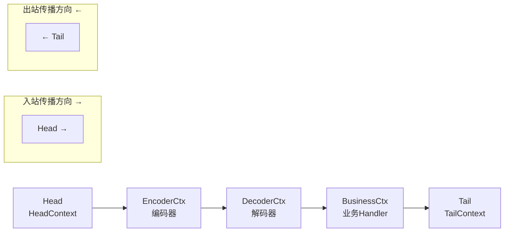
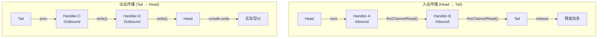

# Pipeline 责任链模式源码分析

ChannelPipeline 是 Netty 的事件传播中心。理解 Pipeline 的实现是掌握 Netty 响应式编程模型的关键。

## Pipeline 的数据结构

Pipeline 是一个**双向链表**，由 `ChannelHandlerContext` 节点组成。

```java
// DefaultChannelPipeline.java
public class DefaultChannelPipeline implements ChannelPipeline {
    // 头节点
    final AbstractChannelHandlerContext head;
    // 尾节点
    final AbstractChannelHandlerContext tail;
    
    // Channel 关联
    private final Channel channel;
}
```

### 链表结构



| 节点 | 作用 |
|------|------|
| Head | 入站起点 + 出站终点（负责实际 IO 操作） |
| Tail | 入站终点（释放消息 + 异常兜底） |
| 中间节点 | 用户添加的 Handler |

### ChannelHandlerContext

```java
// AbstractChannelHandlerContext.java
abstract class AbstractChannelHandlerContext implements ChannelHandlerContext {
    volatile AbstractChannelHandlerContext next;  // 后继节点
    volatile AbstractChannelHandlerContext prev;  // 前驱节点
    private final boolean inbound;                // 是否入站处理器
    private final boolean outbound;               // 是否出站处理器
    private final ChannelPipeline pipeline;       // 所属 Pipeline
}
```

## 事件传播机制

### 入站事件传播

```java
// AbstractChannelHandlerContext.java
// 触发下一个 Inbound Handler
@Override
public ChannelHandlerContext fireChannelRead(Object msg) {
    // 1. 找到下一个 Inbound Handler
    invokeChannelRead(findContextInbound(), msg);
    return this;
}

private AbstractChannelHandlerContext findContextInbound() {
    AbstractChannelHandlerContext ctx = this;
    do {
        ctx = ctx.next;  // 往 Tail 方向找
    } while (!ctx.inbound);  // 直到找到 Inbound Handler 或 Tail
    return ctx;
}

static void invokeChannelRead(final AbstractChannelHandlerContext next, Object msg) {
    next.invoker().invokeChannelRead(next, msg);
    // → 调用 ctx.handler().channelRead(ctx, msg)
}
```

### 出站事件传播

```java
// AbstractChannelHandlerContext.java
// 触发下一个 Outbound Handler
@Override
public ChannelFuture write(Object msg) {
    return write(msg, newPromise());
}

private void write(Object msg, boolean flush, ChannelPromise promise) {
    // 1. 找到下一个 Outbound Handler
    AbstractChannelHandlerContext next = findContextOutbound();
    next.invoker().invokeWrite(next, msg, promise);
}

private AbstractChannelHandlerContext findContextOutbound() {
    AbstractChannelHandlerContext ctx = this;
    do {
        ctx = ctx.prev;  // 往 Head 方向找
    } while (!ctx.outbound);  // 直到找到 Outbound Handler 或 Head
    return ctx;
}
```

### 完整传播流程图



## HeadContext — 链表头

HeadContext 既是 Inbound 也是 Outbound：

```java
final class HeadContext extends AbstractChannelHandlerContext
        implements ChannelOutboundHandler, ChannelInboundHandler {
    
    // Head 的出站终点：真正执行 IO 写操作
    @Override
    public void write(ChannelHandlerContext ctx, Object msg, ChannelPromise promise) {
        unsafe.write(msg, promise);  // 交给 Unsafe 完成最终写入
    }
    
    // Head 的入站起点：读完成事件
    @Override
    public void channelReadComplete(ChannelHandlerContext ctx) {
        ctx.fireChannelReadComplete();
        // 在传播完成后，Head 负责 flush
        readIfIsAutoRead();
    }
}
```

## TailContext — 链表尾

```java
final class TailContext extends AbstractChannelHandlerContext
        implements ChannelInboundHandler {
    
    // Tail 的入站终点：释放未被处理的入站消息
    @Override
    public void channelRead(ChannelHandlerContext ctx, Object msg) {
        onUnhandledInboundMessage(msg);  // 释放消息，打印警告
    }
    
    // Tail 的异常兜底
    @Override
    public void exceptionCaught(ChannelHandlerContext ctx, Throwable cause) {
        onUnhandledInboundException(cause);  // 未捕获异常的默认处理
    }
}
```

## addLast() — 添加 Handler

```java
// DefaultChannelPipeline.java
@Override
public final ChannelPipeline addLast(ChannelHandler... handlers) {
    for (ChannelHandler h : handlers) {
        addLast(null, h);
    }
    return this;
}

@Override
public final ChannelPipeline addLast(EventExecutorGroup group, String name,
                                     ChannelHandler handler) {
    // 1. 包装为 ChannelHandlerContext
    AbstractChannelHandlerContext newCtx = newContext(group, filterName(name, handler), handler);
    
    // 2. 插入到链表 Tail 之前
    addLast0(newCtx);
    
    // 3. 如果 Channel 已注册，触发 handlerAdded
    if (!registered) {
        newCtx.setAddPending();
        callHandlerCallbackLater(newCtx, true);
    } else {
        callHandlerAdded0(newCtx);
    }
    return this;
}

private void addLast0(AbstractChannelHandlerContext newCtx) {
    AbstractChannelHandlerContext prev = tail.prev;  // Tail 的前一个节点
    newCtx.prev = prev;
    newCtx.next = tail;
    prev.next = newCtx;
    tail.prev = newCtx;
    // 双向链表插入操作
}
```

## Handler 跳过机制

如果一个 Handler 只处理 Inbound 事件，出栈事件会自动跳过它：

```java
// Pipeline 自动跳过非相关类型的 Handler
// 例如：ctx.write(msg) 会跳过只实现 ChannelInboundHandler 的节点
// 因为 ChannelInboundHandlerAdapter 的 write 会直接 pass through
```

::: tip 总结
1. Pipeline 是**双向链表**，入站事件从 Head→Tail 传播，出站事件从 Tail→Head 传播
2. Head 负责实际 IO，Tail 负责资源释放和异常兜底
3. 事件通过 `ctx.fireXxx()`（入站）和 `ctx.xxx()`（出站）进行传播
4. Pipeline 自动跳过不相关类型的 Handler
:::
